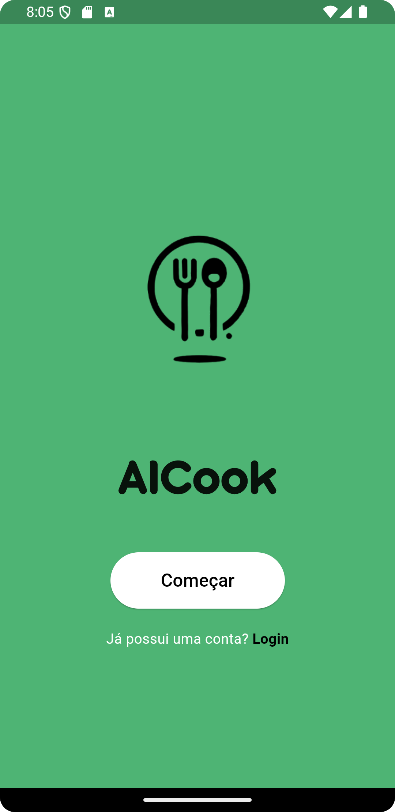
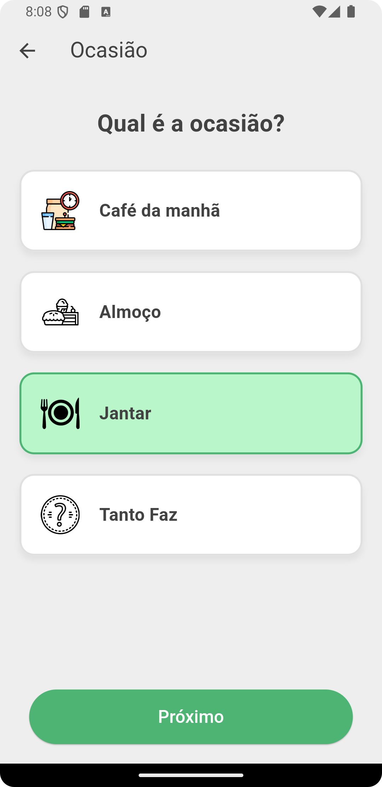
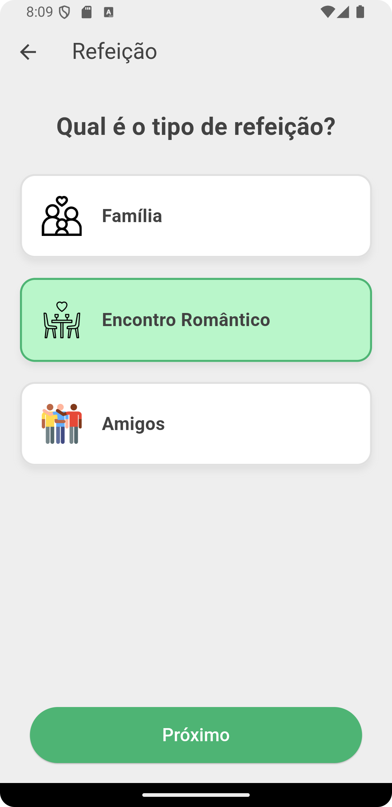
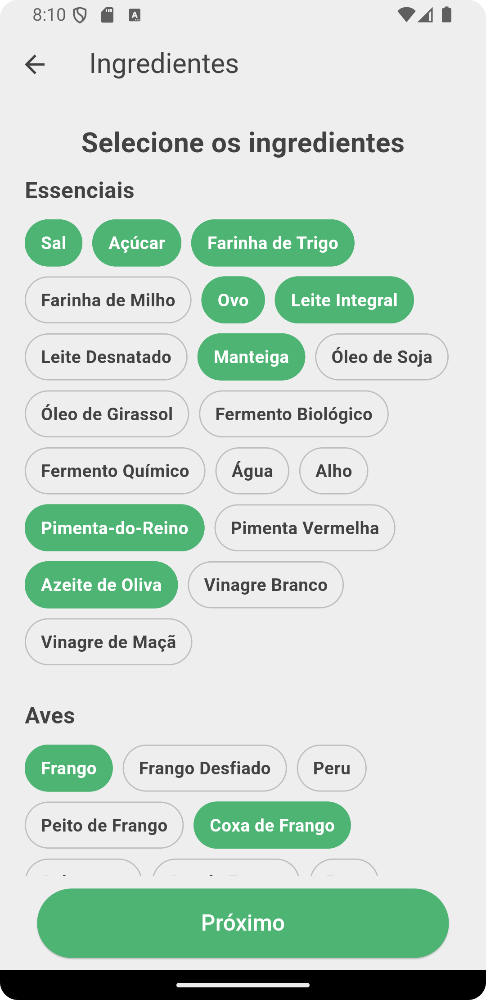
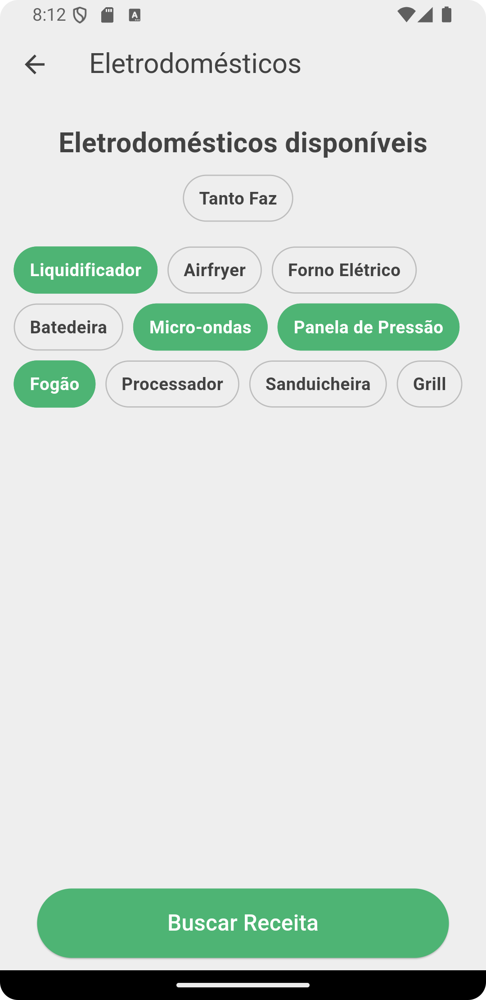
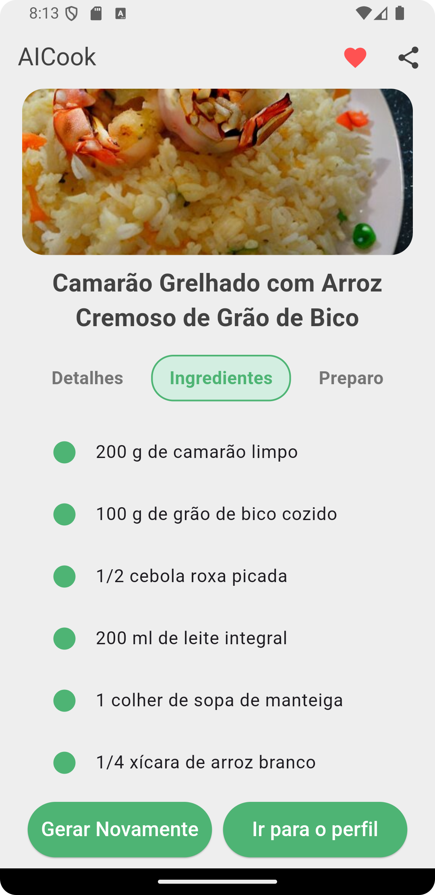
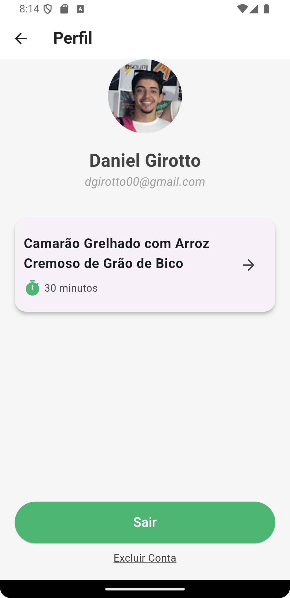

# 🍳 AICook

AICook is your personal kitchen assistant! 🥗 It suggests personalized recipes based on the ingredients you have, the occasion, and your kitchen setup. Powered by AI and seamless API integrations, AICook makes cooking fun, efficient, and tailored to your preferences.

## ✨ Features

- **🔍 Ingredient-Based Recipe Suggestions**: Simply list your ingredients, and AICook will craft recipes around them.
- **🍽️ Meal Type Selection**: Choose the type of meal (e.g., Family Dinner, Romantic Date, Friends Gathering) for personalized suggestions.
- **🎉 Occasion Selection**: From casual lunch to festive dinner, select the occasion to get the perfect recipe.
- **👥 Servings Adjustment**: Specify the number of people, and the recipe adapts.
- **🍳 Appliance Selection**: Let AICook know what kitchen appliances you have, and it will suggest recipes you can actually cook.
- **🤖 AI-Generated Recipes**: Get unique, coherent recipes crafted by AI.
- **🖼️ Image Integration**: Beautiful, relevant recipe images fetched using the Pixabay API.
- **🔐 User Authentication**: Secure sign-in and registration with Firebase.
- **❤️ Favorites**: Save your favorite recipes for quick access later.
- **📱 Responsive Design**: A user-friendly interface, whether you’re on your phone, tablet, or desktop.

## 📸 Screenshots

  
  
  
  
  
  
  
  
  
  
  
  

## 🚀 Usage

1. **👋 Welcome Screen**: Sign up or log in using your email and password.
2. **🏠 Home Screen**: Start by selecting the occasion for your meal.
3. **👥 Select Number of People**: Specify the number of servings needed.
4. **🍽️ Meal Type**: Choose the type of meal (Family, Romantic Dinner, Friends).
5. **🧄 Ingredient Selection**: Pick the ingredients available from categorized lists.
6. **⚙️ Appliance Selection**: Select your available kitchen appliances.
7. **⏳ Loading Screen**: Watch a cool animation while your personalized recipe is being generated.
8. **📜 Recipe Screen**: View your recipe, complete with ingredients, instructions, and an image.
9. **❤️ Favorites**: Save recipes you like for quick access later.

## 🛠️ Technologies Used

- **Flutter**: 🚀 A powerful UI toolkit for building beautiful, natively compiled applications.
- **Dart**: 🏎️ The programming language behind Flutter, optimized for building fast and reliable UIs.
- **Firebase**: 🔐 Backend services for secure authentication and data management.
- **Provider**: 🎯 Simplified state management for your app.
- **Google Generative AI**: 🤖 Intelligent recipe generation based on user preferences.
- **Pixabay API**: 🖼️ Fetching stunning images to make your recipes visually appealing.

## 📂 Project Structure

- `lib/`: Contains the main source code.
  - `models/`: Data models like `Recipe` and `RecipePreferences`.
  - `screens/`: UI screens for different parts of the app.
    - `personalization/`: Screens for selecting preferences (e.g., Ingredients, Appliances).
  - `services/`: API service classes for recipes, images, and authentication.
  - `utils/`: Utility classes for custom colors and reusable helpers.
  - `widgets/`: Reusable UI components to streamline development.
- `assets/`: Contains images, icons, and other static resources.
- `.env`: Environment variables for securely storing API keys.

## 💡 Future Enhancements

- **🌐 Multi-language Support**: Recipes and interface available in multiple languages.
- **🍰 More Custom Recipes**: Expand AI capabilities to generate more diverse recipes.
- **📊 User Analytics**: Track popular recipes and improve suggestions based on user feedback.
